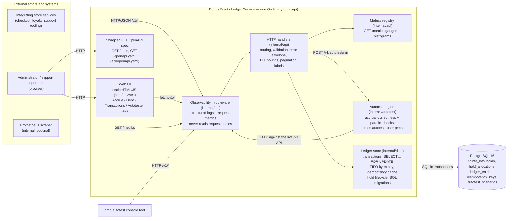
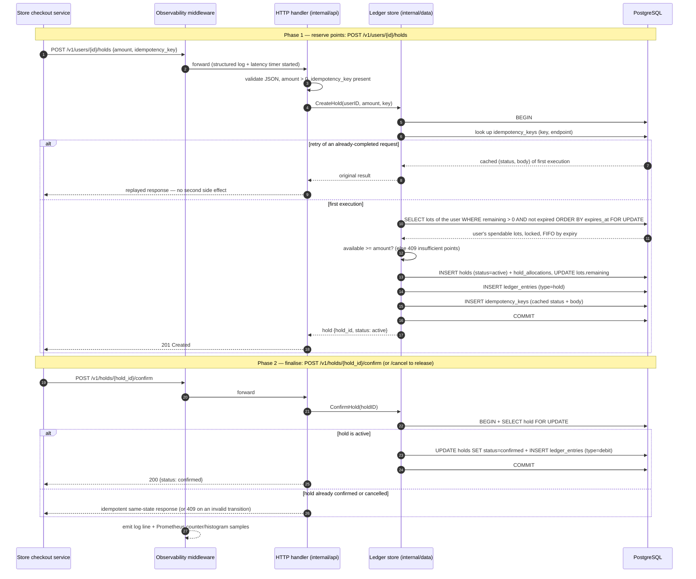
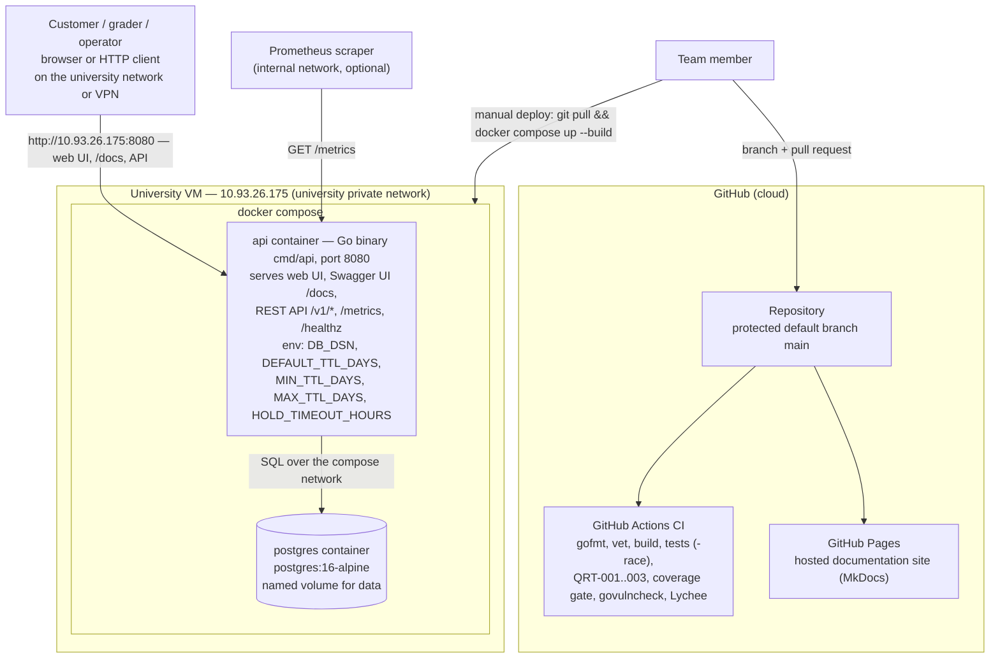

# Architecture

This is the canonical maintained architecture documentation for the **Bonus
Points Ledger Service** — a REST-like service managing an online store's
bonus-points program (configurable expiry, transactional balance mutations,
two-phase debits, idempotency, observability, web UI, autotester).

It documents the **current delivered architecture** (MVP v2, release `v2.0.0`)
through three views, each answering a different reasoning question, and an
index of the Architecture Decision Records (ADRs) that explain *why* the
structure is the way it is. It is a maintained product asset: later work must
keep it current when the product scope, structure, deployment model, or
important risks change.

| View | Question it answers | Source (diagrams-as-code) |
|---|---|---|
| [Static view](#static-view-component-diagram) | What is the system made of and how are the parts related? | [`static-view/component-diagram.mmd`](static-view/component-diagram.mmd) |
| [Dynamic view](#dynamic-view-sequence-diagram-two-phase-redemption) | How does the most important flow actually work at runtime? | [`dynamic-view/two-phase-redemption-sequence.mmd`](dynamic-view/two-phase-redemption-sequence.mmd) |
| [Deployment view](#deployment-view) | Where does the product run and how do users and operators reach it? | [`deployment-view/deployment-diagram.mmd`](deployment-view/deployment-diagram.mmd) |

All diagrams are written in **Mermaid** (diagrams-as-code): the sources are
versioned in the view directories above and rendered in place below, so changes
are reviewable in the normal PR workflow and always readable in context on
GitHub and on the [hosted documentation site](https://varriwon4ik.github.io/avito_bonus_point_service/).

Related maintained assets: [quality requirements](../quality-requirements.md) ·
[quality requirement tests](../quality-requirement-tests.md) ·
[testing status](../testing.md) · [development process](../development-process.md) ·
[Definition of Done](../definition-of-done.md).

---

## Static view (component diagram)

*Source: [`static-view/component-diagram.mmd`](static-view/component-diagram.mmd)*

### What the diagram shows

The product is a **layered monolith in one Go binary**
([ADR-003](adr/ADR-003-layered-monolith-with-gated-critical-modules.md),
[ADR-005](adr/ADR-005-single-binary-web-ui-and-compose-deployment.md)). Every
request — from an integrating store service, the bundled web UI, the console
autotester, or a Prometheus scraper — enters through one observability
middleware, is routed to the HTTP handlers (`internal/api`), and reaches state
only through the ledger store (`internal/data`), which talks to PostgreSQL in
locked transactions. The web UI and Swagger UI are static assets served by the
same binary and consume the same public `/v1` API as external callers — there
are no private backdoor endpoints. The autotest engine (`internal/autotest`)
is shared by two thin frontends (the console tool and the
`POST /v1/autotest/run` endpoint behind the UI's Autotester tab) and also
exercises the service through its public HTTP API. PostgreSQL is the only
stateful component; its six tables (lots, holds, allocations, ledger,
idempotency keys, autotest scenarios) are managed by versioned SQL migrations.

### Coupling, cohesion, and maintainability

- **Cohesion:** each package has one responsibility — `internal/api` owns the
  HTTP contract (routing, validation, error envelope, observability),
  `internal/data` owns persistence and business rules (locking, FIFO-by-expiry,
  idempotency, hold lifecycle), `internal/autotest` owns scenario checking, and
  `cmd/*` are thin process shells. The database schema mirrors the domain
  one-to-one (a table per concept), which keeps the persistence layer's
  vocabulary aligned with the product's.
- **Coupling:** dependencies point one way — `cmd → internal/api →
  internal/data → Postgres` — and the UI/autotester couple to the service only
  through the **public API contract**, not through internals. That makes the
  OpenAPI spec the single seam to maintain: an internal schema change stays
  inside `internal/data`, and a contract change is forced to show up in
  `api/openapi.yaml` where reviewers see it.
- **Maintainability implications:** changes stay local to one layer, PRs stay
  small and reviewable, and each layer is testable against a real Postgres in
  isolation. The cost of the monolith is shared fate at runtime (one process)
  and a single release cadence — acceptable at current scale and revisited in
  ADR-003.

### Quality requirements this structure supports or constrains

- **Supports [QR-002 (integrity)](../quality-requirements.md#qr-002-ledger-integrity-under-concurrency):**
  funnelling *all* state changes through `internal/data`'s locked transactions
  ([ADR-001](adr/ADR-001-postgres-row-locking-for-ledger-integrity.md)) with
  mandatory idempotency keys
  ([ADR-004](adr/ADR-004-client-supplied-idempotency-keys.md)) means no code
  path can bypass the no-double-spend guarantee.
- **Supports [QR-003 (testability)](../quality-requirements.md#qr-003-critical-module-testability):**
  the two critical modules are separable, so the CI coverage gate can target
  them precisely.
- **Supports [QR-001 (time behaviour)](../quality-requirements.md#qr-001-balance-read-response-time):**
  the balance read path is middleware → handler → one indexed aggregate query
  ([ADR-002](adr/ADR-002-lazy-expiry-and-fifo-by-expiry-consumption.md)) — no
  fan-out, no background-job dependency.
- **Constrains scalability/availability:** the *deployed* topology is one
  process and one database instance; per-user mutations serialize on row
  locks. The API tier itself is horizontally scalable — see
  [Horizontal scaling](#horizontal-scaling) below for the explicit statement,
  conditions, and caveats
  ([ADR-006](adr/ADR-006-horizontal-scaling-stateless-api-over-single-postgres.md)).

### Horizontal scaling

**Statement: horizontal scaling of the API tier is possible, with
conditions.** The service was analysed for single-instance assumptions at the
customer's request
([#64](https://github.com/Varriwon4ik/avito_bonus_point_service/issues/64));
the full analysis and decision are recorded in
[ADR-006](adr/ADR-006-horizontal-scaling-stateless-api-over-single-postgres.md).

Why it works: the `api` binary keeps **no ledger state in the process**.
Every correctness mechanism lives in PostgreSQL and is therefore shared by
all replicas:

- **No double-spend** — mutations serialize on `SELECT ... FOR UPDATE` row
  locks in the database (ADR-001), which two replicas contend on exactly like
  two goroutines in one replica.
- **Idempotency** — keys and cached first responses are database rows,
  reserved and committed atomically with the mutation (ADR-004); a retry
  landing on a different replica is replayed correctly.
- **Point expiry** — lazy, a query predicate (ADR-002); nothing to coordinate.
- **Hold-timeout sweeper** — runs in *every* replica, and this is harmless by
  construction: each release re-checks the hold under a row lock and skips
  holds already resolved by a concurrent actor. Duplicate sweeps cost
  duplicate scans and log lines, never a double release.
- **Startup migrations** — replicas apply migrations at boot; a Postgres
  advisory lock in `data.Migrate` serializes concurrent first-boots so they
  cannot race on a fresh database.

Conditions for running more than one replica:

1. **A load balancer** in front of the replicas — the shipped docker compose
   describes the single-replica trial topology only; multi-replica composition
   (and its load testing) is the operator's responsibility.
2. **All replicas point at the same PostgreSQL primary** — the database is the
   single coordination point by design.
3. **Prometheus scrapes each replica directly**, not through the load
   balancer: the `/metrics` registry is in-memory and per-process.

Known caveats: scaling the API tier does **not** scale the database —
PostgreSQL remains the write bottleneck and the single point of failure, and
throughput for a *single hot user* does not improve with replicas (that
user's mutations still serialize on their row locks). Replicas buy API-tier
availability and throughput across many users; database HA (replication,
failover) is standard Postgres operations underneath and out of the product's
current scope.

---

## Dynamic view (sequence diagram: two-phase redemption)

*Source: [`dynamic-view/two-phase-redemption-sequence.mmd`](dynamic-view/two-phase-redemption-sequence.mmd)*

### What scenario the diagram represents and why it matters

The diagram shows a **two-phase redemption at checkout**: the store first
*holds* points while the order is being paid, then *confirms* the hold to spend
them permanently (or *cancels* to release them). This is the product's most
important and least trivial flow — it is where real money-like value is
deducted, where concurrency bugs would cause double-spend, and where a caller
crash between the phases must not strand the user's points. It spans every
component of the static view: client → middleware → handler → store →
PostgreSQL and back, across two separate HTTP requests.

### What the diagram helps the reader reason about

- **Integration boundary:** what a calling service must supply (an
  `idempotency_key` on every mutation) and what it may rely on (replayed
  responses on retry; `409` for insufficient points or invalid transitions;
  unresolved holds auto-release after `HOLD_TIMEOUT_HOURS`). This is the
  contract behind [ADR-004](adr/ADR-004-client-supplied-idempotency-keys.md).
- **Where the QR-002 integrity guarantee physically lives:** the
  `SELECT ... FOR UPDATE` lock on the user's lots inside one transaction
  ([ADR-001](adr/ADR-001-postgres-row-locking-for-ledger-integrity.md)). Two
  concurrent holds for the same user serialize at the marked step; the
  idempotency record commits atomically with the mutation, so there is no
  window where a retry could double-apply.
- **Why FIFO-by-expiry is visible here:** the locked lot selection is ordered
  by `expires_at`, so redemptions always consume the soonest-to-expire points
  ([ADR-002](adr/ADR-002-lazy-expiry-and-fifo-by-expiry-consumption.md)).
- **Observability:** every step of both requests is wrapped by the middleware,
  producing the structured log line and Prometheus samples used to verify
  QR-001 latency behaviour in production-like runs.

---

## Deployment view

*Source: [`deployment-view/deployment-diagram.mmd`](deployment-view/deployment-diagram.mmd)*

### What the diagram shows

Two environments. **GitHub (cloud)** hosts the repository with the protected
`main` branch, the CI pipeline that gates every change, and the GitHub Pages
site that publishes this documentation. The **university VM** runs the product
itself via docker compose: the `api` container (the single Go binary serving
the web UI, Swagger UI, REST API, `/metrics`, and `/healthz` on port 8080) and
the `postgres:16-alpine` container with a named volume for durable data. The
customer-facing access path is `http://10.93.26.175:8080` — reachable only from
the university network or VPN. Deployment is manual: a team member pulls the
release commit on the VM and rebuilds with compose.

### Why this deployment model was chosen, and what it supports or constrains

- **Why:** the customer's spec treats the ledger as an *internal* service on a
  private network (hence unauthenticated endpoints), the team has one free
  university VM, and docker compose reproduces the exact same topology the team
  runs locally and in CI (same Postgres image, same env vars) — so "works
  locally" and "works deployed" are the same claim
  ([ADR-005](adr/ADR-005-single-binary-web-ui-and-compose-deployment.md)).
- **Supports:** trivially reproducible operation (`docker compose up --build`),
  durable state across restarts (named volume), UAT/demo access for the
  customer through one URL, and internal observability via `/metrics`.
- **Constrains:** single VM — no redundancy, so a VM outage is a product
  outage; the private address means graders need VPN access (private access
  instructions go through Moodle); and manual deploys mean the deployed
  version can lag `main` (this bit us in the Sprint 3 review, where the newest
  increment had to be shown undeployed). This is a property of the trial
  deployment, not of the product: the API tier can be scaled out to multiple
  replicas — see [Horizontal scaling](#horizontal-scaling) and
  [ADR-006](adr/ADR-006-horizontal-scaling-stateless-api-over-single-postgres.md).

### Operating it for the customer

- Deploy/update: `git pull` the release tag on the VM, then
  `docker compose up --build -d`. Configuration is environment variables only
  (sanitized example in [`.env.example`](../../.env.example)); no secrets live
  in the repository.
- Health: `GET /healthz` for liveness; `GET /metrics` for request rates,
  latencies, and ledger gauges.
- The endpoints are unauthenticated **by design for a private network** — the
  deployment must never be exposed to the public internet as-is (see the
  security notes in ADR-005).

---

## Architecture decision records (ADR index)

ADR files live in [`adr/`](adr/) and follow the shared ADR semantics (stable
IDs, statuses, preserved history). This section is the maintained index.

| ADR | Decision | Status | Quality requirements |
|---|---|---|---|
| [ADR-001](adr/ADR-001-postgres-row-locking-for-ledger-integrity.md) | Serialize balance mutations in Postgres with `SELECT ... FOR UPDATE` | Accepted | [QR-002](../quality-requirements.md#qr-002-ledger-integrity-under-concurrency) |
| [ADR-002](adr/ADR-002-lazy-expiry-and-fifo-by-expiry-consumption.md) | Lazy point expiry and FIFO-by-expiry consumption | Accepted | [QR-001](../quality-requirements.md#qr-001-balance-read-response-time) |
| [ADR-003](adr/ADR-003-layered-monolith-with-gated-critical-modules.md) | Layered monolith with coverage-gated critical modules | Accepted | [QR-003](../quality-requirements.md#qr-003-critical-module-testability) |
| [ADR-004](adr/ADR-004-client-supplied-idempotency-keys.md) | Client-supplied idempotency keys with cached first responses | Accepted | [QR-002](../quality-requirements.md#qr-002-ledger-integrity-under-concurrency) |
| [ADR-005](adr/ADR-005-single-binary-web-ui-and-compose-deployment.md) | One binary serves API + web UI + autotester; compose deployment | Accepted | [QR-003](../quality-requirements.md#qr-003-critical-module-testability) |
| [ADR-006](adr/ADR-006-horizontal-scaling-stateless-api-over-single-postgres.md) | Stateless API tier is horizontally scalable; PostgreSQL stays the single coordination point | Accepted | [QR-001](../quality-requirements.md#qr-001-balance-read-response-time), [QR-002](../quality-requirements.md#qr-002-ledger-integrity-under-concurrency) |

### How the decisions and the architecture fit together

The three views above are the *what*; the ADRs are the *why*, and each maps to
a visible element of the views. The static view's single `internal/data`
choke-point exists because ADR-001 puts all concurrency control into locked
database transactions and ADR-004 commits idempotency records atomically with
mutations — together they implement QR-002's no-double-spend guarantee end to
end, which the dynamic view walks through step by step. The balance path in the
static view is a single indexed query because ADR-002 made expiry a query
predicate instead of a background job, which is what keeps QR-001's p95 budget
credible. The module boundaries and the web-UI/autotester placement come from
ADR-003 and ADR-005, which trade runtime isolation for locality, testability
(QR-003's per-module coverage gate needs exactly these boundaries), and the
one-VM compose deployment shown in the deployment view. ADR-006 records that
this structure was deliberately audited for horizontal scaling: because
ADR-001/002/004 put every correctness mechanism into the database, adding API
replicas is a deployment change, not a redesign — with PostgreSQL remaining
the single coordination point and bottleneck. When any of these
decisions is revisited, the superseding ADR must be added here and the affected
view(s) updated in the same PR.
