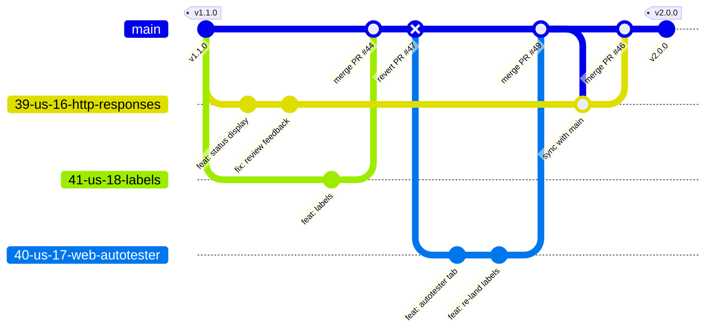

# Development Process and Configuration Management

This is the canonical maintained documentation of the development process
**Team 01 actually uses** in this repository, and of how configuration and
secrets are managed. It reflects current practice, not an aspirational
workflow; when the process or tooling changes, this document changes in the
same PR.

Shared semantics (Work Status values, Definition of Done, PBI rules,
estimation) follow the course process requirements; the team-specific
completion standard is [docs/definition-of-done.md](definition-of-done.md).
The condensed contributor entry point is
[CONTRIBUTING.md](https://github.com/Varriwon4ik/avito_bonus_point_service/blob/main/CONTRIBUTING.md);
AI coding agents additionally follow
[AGENTS.md](https://github.com/Varriwon4ik/avito_bonus_point_service/blob/main/AGENTS.md).

## Contents

- [Backlog and boards](#backlog-and-boards)
- [Workflow states](#workflow-states)
- [Git and review workflow](#git-and-review-workflow)
- [Releases](#releases)
- [Configuration and secrets management](#configuration-and-secrets-management)
- [Reproducible development environment](#reproducible-development-environment)
- [Continuous integration and delivery](#continuous-integration-and-delivery)

## Backlog and boards

- **Product Backlog** — the single ordered source of product work, managed as
  GitHub issues and inspected through the
  [GitHub Projects board](https://github.com/users/Varriwon4ik/projects/1).
  User stories carry stable `US-NNN` IDs mirrored in the registry
  [docs/user-stories.md](user-stories.md); MoSCoW priority, Story Points
  (`effort: N` labels / issue body), MVP version, implementer (assignee), and
  reviewer (issue body field) are recorded on each issue.
- **Sprint Backlog** — the issues assigned to the current Sprint milestone
  (e.g. [Sprint 3](https://github.com/Varriwon4ik/avito_bonus_point_service/milestone/3)).
  The milestone is the authoritative Sprint container: it records the Sprint
  Goal, dates, and selected PBIs. The Projects board filtered by the milestone
  is the Sprint work-management view, showing status, assignee, priority, and
  estimate.
- **Course Tasks** (reporting/evidence work) are tracked with the same tooling
  but labelled `type: course-task` and never counted as PBIs or Sprint scope.
- The Sprint-by-Sprint plan lives in [docs/roadmap.md](roadmap.md).

## Workflow states

Issues use the shared Work Status vocabulary. Entry criteria for each state:

| State | Enter when |
|---|---|
| `To Do` | The PBI exists in the Product Backlog but is not ready to start (missing refinement, estimate, or Sprint selection). |
| `Ready` | Selected for the current Sprint **and** has a clear expected outcome, description, acceptance criteria, Story Points, an implementer, and a different reviewer. |
| `In Progress` | The implementer has created the issue-linked branch and started work. |
| `Review` | An issue-linked PR is open and the recorded reviewer is reviewing; CI is running on the PR. |
| `Done` | Acceptance criteria verified, the [Definition of Done](definition-of-done.md) is satisfied, and the PR is merged into protected `main`. For a user story: all linked supporting PBIs are `Done`. |

## Git and review workflow

The team uses a lightweight **GitHub Flow adapted to the course rules**: one
protected long-lived branch (`main`), short-lived issue-linked feature
branches, mandatory PR review by a different team member, and merge commits
(squash/rebase merging is disabled so PR history stays intact).

### What the diagram shows and how we actually use it

The diagram is a real slice of this repository's Sprint 3 history. `main` is
the protected default branch: direct pushes are disabled and every change —
code, docs, CI config — lands through a reviewed pull request merged with a
**merge commit** (the `merge PR #NN` nodes). Each feature branch is created
from the issue it implements and named `<issue-number>-short-description`
(e.g. `41-us-18-labels`); it carries one focused change and is deleted after
merge. Long-running branches periodically merge `main` back in (the
`sync with main` node) to resolve conflicts on the branch, not on `main`.
The `revert PR #47` node shows the failure path we actually use: when a merged
change turns out broken (US-18's first landing), we revert it with a new
reviewed PR rather than rewriting history — history is append-only until
grading. Releases are SemVer tags (`v1.1.0`, `v2.0.0`) placed on `main`
commits only.

Step by step, for every change:

1. **Issue first.** Work starts from a GitHub issue created with the
   appropriate issue form (User Story, Other PBI, Bug Report, or Course Task;
   blank issues are disabled). The issue records the expected outcome,
   acceptance criteria, Story Points, implementer (assignee), and a different
   reviewer.
2. **Branch from the issue**, named `<issue-number>-short-description`.
3. **Open a PR** to `main` using the PR template: summary, related issue
   (`Closes #NN`), testing performed, acceptance-criteria verification, and the
   changelog checklist (exactly one of: updated `CHANGELOG.md` / not
   user-visible).
4. **CI runs automatically** on the PR (see
   [Continuous integration](#continuous-integration-and-delivery)); a red build
   blocks merge via required status checks.
5. **Review** by the recorded reviewer (never the author — self-approval is
   disabled). The reviewer verifies the acceptance criteria against the change
   and leaves at least one substantive comment; requested changes go back to
   step 4.
6. **Merge** with a merge commit once approved and green. The `Closes #NN`
   link closes the issue automatically; the issue's Work Status becomes `Done`
   only if the Definition of Done holds.
7. Automated dependency-update PRs skip the issue requirement but still need
   review and green checks.

## Releases

Releases follow [Semantic Versioning](https://semver.org/) with `v`-prefixed
tags pointing at protected-`main` commits. Each course MVP maps to one release
(`v1.0.0` → MVP v1, `v2.0.0` → MVP v2). On release, the `[Unreleased]` section
of [CHANGELOG.md](../CHANGELOG.md) (Keep a Changelog format, issue-linked
entries for every user-visible change) is cut into a dated version section.
Mapped tags are not moved or deleted until grading is complete.

## Configuration and secrets management

- **Runtime configuration is environment variables only** — no config files
  are read at runtime. The product understands: `DB_DSN` (Postgres connection),
  `DEFAULT_TTL_DAYS`, `MIN_TTL_DAYS`, `MAX_TTL_DAYS` (accrual TTL default and
  US-08 bounds), `HOLD_TIMEOUT_HOURS` (stale-hold auto-release), and — for the
  test suite — `TEST_DATABASE_URL` plus the QRT budget overrides
  (`QRT_BALANCE_P95_BUDGET_MS`, `COVERAGE_THRESHOLD`).
- **Committed sanitized example:** [`.env.example`](../.env.example) documents
  every variable with safe local-development values. Real `.env` files are
  ignored via [`.gitignore`](../.gitignore) and never committed.
- **Where secrets live:** the repository contains **no production secrets**.
  The only credentials in the repo are the throwaway local/CI Postgres
  credentials (`bonus:bonus`) used by docker compose and the CI service
  container — they guard nothing outside those disposable containers. Private
  deployment access details (VM credentials, VPN instructions) are never
  committed; they are shared with instructors only through Moodle.
- **CI configuration** is versioned in
  [`.github/workflows/`](../.github/workflows/) and changed only via reviewed
  PRs. The workflows use no repository secrets: the CI database is an ephemeral
  service container, and the `GITHUB_TOKEN` runs with least-privilege
  (`contents: read`; the docs workflow additionally has `pages: write`).
- **Deployment configuration** is [`docker-compose.yml`](../docker-compose.yml)
  plus [`Dockerfile`](../Dockerfile) — the same files locally, in CI (mirrored
  service container), and on the VM, with environment overrides applied on the
  VM at deploy time.
- **Guard rails:** the observability middleware never reads or logs request
  bodies, so payload data cannot leak into logs; large binaries and recordings
  are excluded from git history per the repository rules; if sensitive data is
  ever committed, the course incident-response procedure applies (revoke,
  notify TA, scrub history).

## Reproducible development environment

- **Go toolchain pinned in [`go.mod`](../go.mod)** — CI installs exactly that
  version (`setup-go` with `go-version-file`), and locally any Go ≥ the pinned
  version bootstraps the right toolchain automatically. Dependencies are locked
  by `go.mod`/`go.sum` and verified in CI with `go mod verify`.
- **Database via docker compose:** `docker compose up -d postgres` gives every
  developer the same `postgres:16-alpine` the deployment and CI use; the full
  product runs with `docker compose up --build` and no other host dependencies
  beyond Docker.
- **[`Makefile`](../Makefile)** wraps the common tasks (build, test, run) so
  commands are uniform across machines.
- The repository intentionally has no Nix/devenv setup: Docker plus the pinned
  Go toolchain already make local, CI, and VM environments match, and adding a
  second environment system would double the maintenance surface for a
  four-person team.

## Continuous integration and delivery

- **CI:** every push and every PR to `main` runs the
  [CI workflow](../.github/workflows/ci.yml) — `go mod verify`, `gofmt`,
  `go vet`, build, the full test suite with the race detector against a real
  Postgres service container, the automated quality requirement tests
  (QRT-001/002), the per-module ≥30% coverage gate (QRT-003), and the
  `govulncheck` vulnerability scan — plus the
  [Lychee link-check workflow](../.github/workflows/lychee.yml) for all
  Markdown. Branch protection makes the checks required, so `main` stays
  releasable. Status and evidence: [docs/testing.md](testing.md).
- **Docs delivery:** the [docs workflow](../.github/workflows/docs.yml) builds
  the MkDocs site from `docs/` and publishes it to GitHub Pages on every merge
  to `main` — documentation is continuously delivered.
- **Product delivery is not (yet) automated:** deploys to the university VM are
  manual (`git pull` the release commit, `docker compose up --build -d`). The
  team accepts this for the current single-VM setup; the known cost is that the
  deployed version can lag `main` (see
  [ADR-005](architecture/adr/ADR-005-single-binary-web-ui-and-compose-deployment.md)),
  and deploy automation is a tracked candidate improvement.
