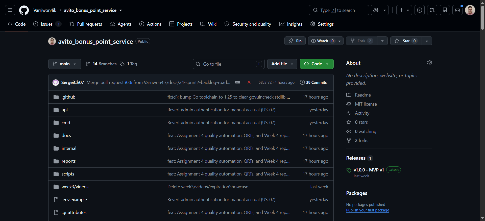
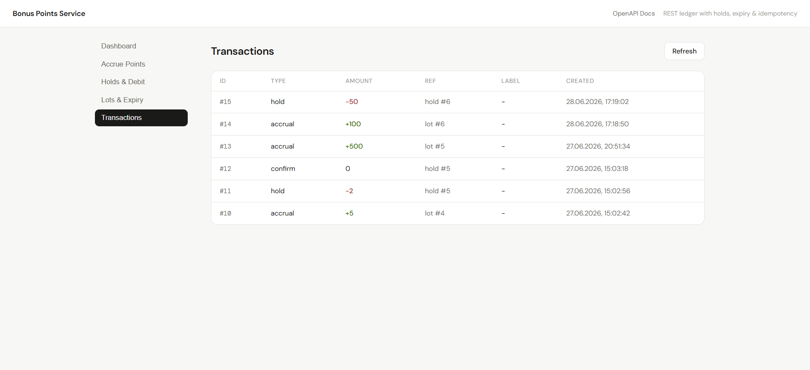

# Week 4 Report — Assignment 4 (Sprint 2)

> Canonical public Week 4 report and submission index for Assignment 4,
> Team 01 — Bonus Points Ledger Service. All public evidence for the assignment
> is indexed here.

## 1. Project

**Bonus Points Ledger Service** — a REST-like service for managing an online
store's bonus-points program: configurable point expiry, transactional balance
mutations with row-level locking, two-phase debits (`hold` / `confirm` /
`cancel`), idempotent operations, FIFO-by-expiry consumption, paginated history,
and observability (structured logging + Prometheus `/metrics`).

- Repository: <https://github.com/Varriwon4ik/avito_bonus_point_service>
- License: [LICENSE](../../LICENSE)

## 2. Planning and Sprint

- **Product Backlog board:** <https://github.com/users/Varriwon4ik/projects/1>
- **Sprint Backlog board/table:** the same Project filtered to the Sprint 2
  milestone — <https://github.com/Varriwon4ik/avito_bonus_point_service/milestone/2>
- **Assignment 4 Sprint milestone:**
  [Sprint 2](https://github.com/Varriwon4ik/avito_bonus_point_service/milestone/2)
- **Sprint Goal:** strengthen the reliability and verifiability of the increment
  by delivering an automated autotester and a CI pipeline that gate every change,
  while demonstrating paginated transaction-history access to the customer.
- **Sprint dates:** 22–28 June 2026 (Mon–Sun).
- **Scope summary:** quality/automation-focused Sprint — CI pipeline (US-14),
  automated autotester (US-15), and pagination for transaction history (US-09).
- **Total Sprint size:** **16 Story Points** (US-14 = 8, US-15 = 5, US-09 = 3).
  US-07 (manual-accrual auth) was implemented then reverted and is excluded.

## 3. Delivered product changes

| PBI | Item | Issue | PR | Implementer | Reviewer |
|---|---|---|---|---|---|
| US-14 | CI pipeline for every change | [#28](https://github.com/Varriwon4ik/avito_bonus_point_service/issues/28) | [#33](https://github.com/Varriwon4ik/avito_bonus_point_service/pull/33) | @Varriwon4ik | @SergeiCh07 |
| US-15 | Automated autotester for accruals/concurrency | [#29](https://github.com/Varriwon4ik/avito_bonus_point_service/issues/29) | [#31](https://github.com/Varriwon4ik/avito_bonus_point_service/pull/31) | @kadambaevsanzhar | @NurikDen |
| US-09 | Pagination for transaction history | [#6](https://github.com/Varriwon4ik/avito_bonus_point_service/issues/6) | [#30](https://github.com/Varriwon4ik/avito_bonus_point_service/pull/30) | @NurikDen | @Varriwon4ik |
| US-07 | Manual-accrual admin auth (reverted) | [#4](https://github.com/Varriwon4ik/avito_bonus_point_service/issues/4) | [#32](https://github.com/Varriwon4ik/avito_bonus_point_service/pull/32) → revert [#34](https://github.com/Varriwon4ik/avito_bonus_point_service/pull/34) | @SergeiCh07 | @kadambaevsanzhar |

Plus the Assignment 4 quality automation: automated QRTs, a per-module coverage
gate, and a `govulncheck` scan in CI (see §6–§9).

## 4. Deployment and access

- **Deployed increment:** `http://10.93.26.175:8080/` (web UI; Swagger at `/docs`;
  API). Hosted on the University VM — a private (RFC 1918) address reachable only
  on the university network/VPN. Private access details for graders are submitted
  through Moodle.
- **Run instructions:** [root README → Running](../../README.md#running) and
  [→ Deployment](../../README.md#deployment).

## 5. Customer feedback response

| Feedback point | Resulting PBI or issue | Status | Response |
|---|---|---|---|
| Provide additional automated tests run against the earlier product version to prove the team's changes are valid. | [US-15](https://github.com/Varriwon4ik/avito_bonus_point_service/issues/29) (autotester) + automated QRTs/CI gates | Partially addressed | The autotester replays accrual/concurrency scenarios against a running instance, and QR-002 integrity is now a race-enabled CI test. Broader legacy-path regression coverage continues in Sprint 3. |
| Demonstrate paginated access to transaction history. | [US-09](https://github.com/Varriwon4ik/avito_bonus_point_service/issues/6) | Done | `page`/`offset` pagination with a `{page, offset, total, entries}` envelope; demonstrated live and accepted in UAT-003. |
| (Sprint 1) Show US-05 auto-release live; model expiry as an explicit ledger transaction. | [docs/roadmap.md](../../docs/roadmap.md) Sprint 3 follow-ups | Deferred | Not in this quality-focused Sprint; carried as Sprint 3 candidates. |

**Feedback not addressed this Sprint:** broader regression coverage of older code
paths and the expiry-as-explicit-transaction model are deferred to Sprint 3 with
rationale (this Sprint prioritized CI, the autotester, and pagination). They
remain tracked in [docs/roadmap.md](../../docs/roadmap.md).

## 6. Maintained quality documentation

- [docs/roadmap.md](../../docs/roadmap.md)
- [docs/definition-of-done.md](../../docs/definition-of-done.md)
- [docs/quality-requirements.md](../../docs/quality-requirements.md)
- [docs/quality-requirement-tests.md](../../docs/quality-requirement-tests.md)
- [docs/testing.md](../../docs/testing.md)
- [docs/user-acceptance-tests.md](../../docs/user-acceptance-tests.md)
- [docs/user-stories.md](../../docs/user-stories.md)

## 7. Quality model and quality requirements

Quality requirements use the **ISO/IEC 25010** model, each a distinct
sub-characteristic:

| QR | Sub-characteristic | Scenario (measure) | Verified by |
|---|---|---|---|
| QR-001 | Time behaviour | Balance read p95 ≤ 200 ms over 200 requests | QRT-001 |
| QR-002 | Integrity | No overspend / negative balance under concurrent debits | QRT-002 |
| QR-003 | Testability | Critical modules ≥ 30% line coverage | QRT-003 |

Details: [docs/quality-requirements.md](../../docs/quality-requirements.md).

## 8. Testing status

- **Critical modules:** `internal/data` (persistence, transactional mutations,
  FIFO, idempotency, business rules) and `internal/api` (handlers, contract,
  middleware). Both are gate-enforced at **≥ 30% line coverage**; exact
  percentages are in the latest CI coverage output.
- **Unit tests:** [internal/data/holds_test.go](../../internal/data/holds_test.go)
- **Integration tests:**
  [integration_test.go](../../internal/api/integration_test.go),
  [pagination_test.go](../../internal/api/pagination_test.go),
  [metrics_integration_test.go](../../internal/api/metrics_integration_test.go),
  [concurrent_idempotency_test.go](../../internal/api/concurrent_idempotency_test.go)
- **Automated QRTs:** [internal/api/qrt_test.go](../../internal/api/qrt_test.go)
  (QRT-001, QRT-002) and
  [scripts/coverage_gate.sh](../../scripts/coverage_gate.sh) (QRT-003)
- Full status, coverage, and additional-QA rationale:
  [docs/testing.md](../../docs/testing.md)

## 9. CI, gates, and additional QA check

- **CI pipeline:** [.github/workflows/ci.yml](../../.github/workflows/ci.yml)
- **Latest protected-branch CI run:**
  [Actions › CI › branch:main](https://github.com/Varriwon4ik/avito_bonus_point_service/actions/workflows/ci.yml?query=branch%3Amain)
- **Pipeline gates:** `gofmt`, `go vet`, build, unit + integration tests (race),
  automated QRTs, per-module coverage gate (≥30%), and the **additional QA
  check** — `govulncheck` dependency/standard-library vulnerability scan
  (distinct from lint/format/build/test/coverage/QRT and the Lychee link check).
- **Branch protection:** the default branch is protected by a repository ruleset
  requiring a pull request and passing required status checks, with direct
  pushes, force-pushes, and deletion disabled. Screenshot:
  `images/branch-protection.png` (see [images/](images/README.md)).
- **Continuity:** these Assignment 4 gates are maintained and continue to govern
  later work — see [docs/testing.md](../../docs/testing.md) and
  [docs/definition-of-done.md](../../docs/definition-of-done.md). Later PBIs must
  keep them passing or replace a check with a documented equivalent/stronger one.

## 10. Release and changelog

- **Changelog:** [CHANGELOG.md](../../CHANGELOG.md)
- **SemVer release mapped to the Sprint 2 increment:** `v1.1.0` — to be tagged
  from `main` after this Sprint's pull request is reviewed and merged (it must
  point to a commit on the protected default branch). Releases page:
  <https://github.com/Varriwon4ik/avito_bonus_point_service/releases>. The
  release will link this milestone, the run instructions, and the demo video.
- Previous release: [v1.0.0 (MVP v1)](https://github.com/Varriwon4ik/avito_bonus_point_service/releases/tag/v1.0.0).

## 11. Demo video

- **Public sanitized demo video (< 2 min):** _pending — link to be added here and
  on the `v1.1.0` release._ Uses only sanitized demo data.

## 12. UAT results (public, sanitized)

The customer executed three active UAT scenarios via a guided code-and-behaviour
walkthrough during the recorded session on 28 June 2026:

- **UAT-001** Read a user's points balance — **Passed**
- **UAT-002** Two-phase redemption (hold → confirm / cancel) — **Passed**
- **UAT-003** Review paginated transaction history — **Passed**

No scenario failed and no defect PBI was opened. Most important feedback: continue
expanding automated tests that prove the changes are valid against earlier
behaviour (Sprint 3 follow-up). Full scenarios and execution history:
[docs/user-acceptance-tests.md](../../docs/user-acceptance-tests.md).

## 13. Customer review artifacts

- **Transcript (publication permitted):**
  [customer-review-transcript.md](customer-review-transcript.md)
- **Summary:** [customer-review-summary.md](customer-review-summary.md)
- The private recording link and exact recording timecodes (incl. the
  customer-executed UAT segment) are submitted via Moodle and are not committed
  to the public repository.

## 14. Reflection, retrospective, LLM report

- [reflection.md](reflection.md)
- [retrospective.md](retrospective.md)
- [llm-report.md](llm-report.md)

## 15. Current product status

The Sprint 2 increment is deployed on the University VM and serves the API, web
UI, Swagger UI, and `/metrics`. Every change is now gated by CI (build, tests,
QRTs, coverage, vulnerability scan) with a protected default branch. The customer
inspected the increment file-by-file, executed three UAT scenarios (all passed),
and approved the version and the team's design decisions.

## 16. Next steps

- Tag the `v1.1.0` release from `main` after merge and attach the demo video.
- Sprint 3: extend regression coverage over legacy code paths (customer request);
  pull US-01, US-02, US-08; revisit admin auth (former US-07) with a hardened,
  fully tested design. See [docs/roadmap.md](../../docs/roadmap.md).
- Fill exact per-module coverage percentages into
  [docs/testing.md](../../docs/testing.md) from the first green CI run on `main`.

## 17. Contribution traceability

| Member | GitHub | Roles | Issues / PRs (implementer) | Review activity | Testing / quality / automation / docs |
|---|---|---|---|---|---|
| Mikhail Ilin | [@Varriwon4ik](https://github.com/Varriwon4ik) | PM; QA; Backend | US-14 ([PR #33](https://github.com/Varriwon4ik/avito_bonus_point_service/pull/33)); reverted US-07 ([PR #34](https://github.com/Varriwon4ik/avito_bonus_point_service/pull/34)) | Reviewed US-09 ([#30](https://github.com/Varriwon4ik/avito_bonus_point_service/pull/30)) | CI pipeline, Sprint milestone, backlog/roadmap docs |
| Nurislam Denisov | [@NurikDen](https://github.com/NurikDen) | QA; Backend | US-09 ([PR #30](https://github.com/Varriwon4ik/avito_bonus_point_service/pull/30)) | Reviewed US-15 ([#31](https://github.com/Varriwon4ik/avito_bonus_point_service/pull/31)) and the revert ([#34](https://github.com/Varriwon4ik/avito_bonus_point_service/pull/34)) | Pagination + tests |
| Sanzhar Kadambaev | [@kadambaevsanzhar](https://github.com/kadambaevsanzhar) | Scrum Master; QA | US-15 ([PR #31](https://github.com/Varriwon4ik/avito_bonus_point_service/pull/31)) | Reviewed US-07 ([#32](https://github.com/Varriwon4ik/avito_bonus_point_service/pull/32)) | Autotester tool + scenarios |
| Sergey Chuenko | [@SergeiCh07](https://github.com/SergeiCh07) | Scrum Master; QA | US-07 ([PR #32](https://github.com/Varriwon4ik/avito_bonus_point_service/pull/32), reverted) | Reviewed US-14 ([#33](https://github.com/Varriwon4ik/avito_bonus_point_service/pull/33)) | Manual-accrual attempt, UAT execution |

## 18. Screenshots

Public, sanitized screenshots of the repository and the delivered increment.

### Repository on `main` after merging the Sprint 2 work (PR #36)

### Deployed web UI — paginated transaction history (US-09)

Further evidence is inspectable at the live links elsewhere in this report: the
[Sprint 2 milestone](https://github.com/Varriwon4ik/avito_bonus_point_service/milestone/2),
the [latest CI run on `main`](https://github.com/Varriwon4ik/avito_bonus_point_service/actions/workflows/ci.yml?query=branch%3Amain)
(showing the QRTs, coverage gate, and `govulncheck` jobs), and the example
reviewed, issue-linked PR [#30](https://github.com/Varriwon4ik/avito_bonus_point_service/pull/30).

> **Privacy note:** screenshots of the customer-review / UAT video session contain
> customer-identifying information (faces and names) and are therefore **not**
> published in this public repository. They are submitted privately through
> Moodle, consistent with the assignment's public/private evidence rules.

## 19. Example reviewed, issue-linked PR

[PR #30 — pagination (US-09)](https://github.com/Varriwon4ik/avito_bonus_point_service/pull/30):
issue-linked, reviewed and approved by a different team member, merged into the
protected default branch via a merge commit.
